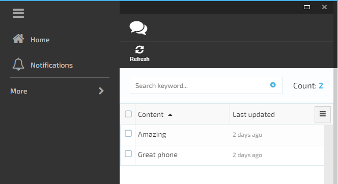

# How to build and customize platform manager Web UI (Angular)

## Summary

Use this guide to create Platform Manager UI for the Virto Commerce "Customer Reviews" module (created in the [Lesson 3](/lesson3.md)). There will be an UI created for list and view the number of product reviews.

After completing this lesson, a Platform Manager UI for the Virto Commerce "Customer Reviews" module will be created, including:

* blade with the list of customer reviews for products;
* widget on the product page to view the number of reviews.

## Video

https://web.microsoftstream.com/video/43fd5a0a-d482-4de9-93af-4e0ad0837601  

## Prerequisites

* Installed Virto Commerce Platform Manager
* Visual Studio 2017 or higher
* Basic JavaScript (Angular) knowledge
* Passed [Lesson 3](/lesson3.md)

## Glossary

* JS – JavaScript;
* Platform - Virto Commerce Platform;
* Platform Manager – Virto Commerce Platform Manager, UI for Platform managing;
* VC – Virto Commerce;
* VS – Visual Studio;
* UI – User Interface.

## Platform UI elements

### Blade

Blade is a main UI element of the Platform Manager. Every blade has basic parts such as Maximize, Close buttons on the top and the title, toolbar, main content placeholders following down. You can find out all the blade features on the [Blade constructor](https://virtocommerce.com/guides/blade-constructor)

Read more about blades in the [Blades and navigation](https://virtocommerce.com/docs/vc2devguide/working-with-platform-manager/basic-functions/blades-and-navigation) article.

### Main menu

### Toolbar

A blade toolbar is a dedicated area inside blade for adding commands. Hereinafter, the toolbar commands shall be referenced to as toolbar items.

Read more about toolbar in the [Blade toolbar](https://virtocommerce.com/docs/vc2devguide/working-with-platform-manager/basic-functions/blade-toolbar) article.

### Metaform

A metaform is a placeholder (container) control that renders UI content based on provided metadata.

A meta-field is a JavaScript object defining metadata for a single logical element inside metaform being rendered.

Read more about metaform in the [Metaform](https://virtocommerce.com/docs/vc2devguide/working-with-platform-manager/basic-functions/metaform) article.

### Widget container

A widget is a relatively simple and intuitive web UI component in Platform Manager. It has the role of a transient or auxiliary tile, meaning that:

* it occupies just a portion of a blade;
* provides some useful information displayed in place;
* usually enables opening additional blade with extra information and functionality;
* is reusable and can be added to many blades (widget containers) in various places.

A widget container is a placeholder control for widgets.

Read more about widget container in the [Widgets](https://virtocommerce.com/docs/vc2devguide/working-with-platform-manager/basic-functions/widgets) article.

## Scripts debugging

To debug JS code at run-time use special debugging tools in browser. You can read more about Chrome debug tools and how to debug any JS issue in this [article](https://javascript.info/debugging-chrome). In order to enable JS debugging, change platform's Web.config, app setting **VirtoCommerce:EnableBundlesOptimizations** value to false:

```xml
<add key="VirtoCommerce:EnableBundlesOptimizations" value="false" />
```

## How to define blade for Customers review module

1. To get and update data from backend define *search* and *update* API controller methods in *\CustomerReviewsModule.Web\Scripts\resources\customer-reviews-module-api.js* file.

```JS
angular.module('customerReviewsModule')
    .factory('customerReviewsModule.webApi', ['$resource', function ($resource) {
        return $resource('api/CustomerReviewsModule', {}, {
            search: { method: 'POST', url: 'api/customerReviewsModule/search' },
            update: { method: 'PUT' }
        });
}]);

```

2. To show a Customer reviews list in a blade create a new *reviews-list.tpl.html* blade template file in *\CustomerReviewsModule.Web\Scripts\blades* folder .

3. Add code to *reviews-list.tpl.html* blade template :

```html
<div class="blade-static">
    <div class="form-group">
        <div class="form-input __search">
            <input placeholder="{{'platform.placeholders.search-keyword' | translate}}" ng-model="filter.keyword" ng-keyup="$event.which === 13 && filter.criteriaChanged()" />
            <button class="btn __other" style="position: relative;right: 45px;">
                <i class="btn-ico fa fa-times-circle" title="Clear" ng-click="filter.keyword=null;filter.criteriaChanged()"></i>
            </button>
        </div>
        <p class="form-count">{{ 'platform.list.count' | translate }}: <span class="count">{{pageSettings.totalItems | number:0}}</span></p>
    </div>
</div>
<div class="blade-static __bottom" ng-if="pageSettings.itemsPerPageCount < pageSettings.totalItems" ng-include="'pagerTemplate.html'"></div>
<div class="blade-content">
    <div class="blade-inner">
        <div class="inner-block">
            <div class="table-wrapper" ng-init="setGridOptions({
                    useExternalSorting: true,
                    rowTemplate: 'list.row.html',
                    columnDefs: [
                                { name: 'content', displayName: 'customerReviews.blades.review-list.labels.content' },
                                { name: 'modifiedDate', displayName: 'customerReviews.blades.review-list.labels.modifiedDate', sort: { direction: uiGridConstants.DESC }}
                        ]})">
                <div ui-grid="gridOptions" ui-grid-auto-resize ui-grid-save-state ui-grid-selection ui-grid-resize-columns ui-grid-move-columns ui-grid-pinning ui-grid-height></div>
            </div>
            <p class="note" ng-if="!blade.currentEntities.length">{{ 'customerReviews.blades.review-list.labels.no-review' | translate }}</p>
        </div>
    </div>
</div>

<script type="text/ng-template" id="list.row.html">
    <div ng-click="grid.appScope.blade.selectNode(row.entity)" ng-repeat="(colRenderIndex, col) in colContainer.renderedColumns track by col.uid" ui-grid-one-bind-id-grid="rowRenderIndex + '-' + col.uid + '-cell'" class="ui-grid-cell" ng-class="{'ui-grid-row-header-cell': col.isRowHeader, '__hovered': grid.appScope.contextMenuEntity === row.entity, '__selected': row.entity.id===grid.appScope.selectedNodeId }" role="{{col.isRowHeader ? 'rowheader' : 'gridcell' }}" ui-grid-cell></div>
</script>
```

3. To fulfill data into the blade create a new *reviews-list.js* blade JS file in *\CustomerReviewsModule.Web\Scripts\blades* folder to show a Customer reviews list.

4. Define *customerReviewsModule.reviewsListController* by adding code to the *reviews-list.js* file:

```JS
angular.module('customerReviewsModule')
    .controller('customerReviewsModule.reviewsListController', ['$scope', 'customerReviewsModule.webApi', 'platformWebApp.bladeUtils', 'uiGridConstants', 'platformWebApp.uiGridHelper',
        function ($scope, reviewsApi, bladeUtils, uiGridConstants, uiGridHelper) {
            $scope.uiGridConstants = uiGridConstants;

            var blade = $scope.blade;
            var bladeNavigationService = bladeUtils.bladeNavigationService;

            blade.getSearchCriteria = function () {
                return angular.extend(filter, {
                    searchPhrase: filter.keyword ? filter.keyword : undefined,
                    sort: uiGridHelper.getSortExpression($scope),
                    skip: ($scope.pageSettings.currentPage - 1) * $scope.pageSettings.itemsPerPageCount,
                    take: $scope.pageSettings.itemsPerPageCount
                });
            };

            blade.refresh = function () {
                blade.isLoading = true;
                reviewsApi.search(blade.getSearchCriteria(), function (data) {
                    blade.isLoading = false;
                    $scope.pageSettings.totalItems = data.totalCount;
                    blade.currentEntities = data.results;
                });
            };


            blade.headIcon = 'fa-comments';

            blade.toolbarCommands = [
                {
                    name: "platform.commands.refresh", icon: 'fa fa-refresh',
                    executeMethod: blade.refresh,
                    canExecuteMethod: function () {
                        return true;
                    }
                }
            ];

            // simple and advanced filtering
            var filter = $scope.filter = blade.filter || {};

            filter.criteriaChanged = function () {
                if ($scope.pageSettings.currentPage > 1) {
                    $scope.pageSettings.currentPage = 1;
                } else {
                    blade.refresh();
                }
            };

            // ui-grid
            $scope.setGridOptions = function (gridOptions) {
                uiGridHelper.initialize($scope, gridOptions, function (gridApi) {
                    uiGridHelper.bindRefreshOnSortChanged($scope);
                });
                bladeUtils.initializePagination($scope.$parent);
            };

        }]);
```

5. Register a created controller in the Angular module by editing *\CustomerReviewsModule.Web\Scripts\module.js*

```JS
~~~
angular.module(moduleName, [])
    .config(['$stateProvider', '$urlRouterProvider',
        function ($stateProvider, $urlRouterProvider) {
            $stateProvider
                .state('workspace.customerReviewsModuleState', {
                    url: '/customerReviewsModule',
                    templateUrl: '$(Platform)/Scripts/common/templates/home.tpl.html',
                    controller: [
                        '$scope', 'platformWebApp.bladeNavigationService', function ($scope, bladeNavigationService) {
                            var newBlade = {
                                id: 'reviewsList',
                                controller: 'customerReviewsModule.reviewsListController',
                                template: 'Modules/$(CustomerReviewsModule)/Scripts/blades/reviews-list.tpl.html',
                                isClosingDisabled: true
                            };
                            bladeNavigationService.showBlade(newBlade);
                        }
                    ]
                });
        }
    ])

~~~
```

6. Define controller permissions by editing *\CustomerReviewsModule.Web\Scripts\module.js*

```JS
 ~~~
  .run(['$rootScope', 'platformWebApp.mainMenuService', 'platformWebApp.widgetService', '$state',
        function ($rootScope, mainMenuService, widgetService, $state) {
            //Register module in main menu
            var menuItem = {
                path: 'browse/customerReviewsModule',
                icon: 'fa fa-comments',
                title: 'Customer Reviews',
                priority: 100,
                action: function () { $state.go('workspace.customerReviewsModuleState') },
                permission: 'CustomerReviewsModule:read'
            };
            mainMenuService.addMenuItem(menuItem);
        }
    ]);
~~~
```

7. Delete *\CustomerReviewsModule.Web\Scripts\blades\hello-world.html* and *\CustomerReviewsModule.Web\Scripts\blades\hello-world.js* files

Save all changes, restart application and open blade in main menu. You should see existing Customer reviews list.



## How to define widget for Customers review module

1. Add new *widgets* folder in *\CustomerReviewsModule.Web\Scripts* folder

2. Define *customerReviewsModule.customerReviewWidgetController* by adding code to the *customerReviewWidget.js* file in *\CustomerReviewsModule.Web\Scripts\widgets* folder

```JS
angular.module('customerReviewsModule')
    .controller('customerReviewsModule.customerReviewWidgetController', ['$scope', 'customerReviewsModule.WebApi', 'platformWebApp.bladeNavigationService', function ($scope, reviewsApi, bladeNavigationService) {
        var blade = $scope.blade;
        var filter = { take: 0 };

        function refresh() {
            $scope.loading = true;
            reviewsApi.search(filter, function (data) {
                $scope.loading = false;
                $scope.totalCount = data.totalCount;
            });
        }

        $scope.openBlade = function () {
            if ($scope.loading || !$scope.totalCount)
                return;

            var newBlade = {
                id: "reviewsList",
                filter: filter,
                title: 'Customer reviews for "' + blade.title + '"',
                controller: 'customerReviewsModule.reviewsListController',
                template: 'Modules/$(CustomerReviewsModule)/Scripts/blades/reviews-list.tpl.html'
            };
            bladeNavigationService.showBlade(newBlade, blade);
        };

        $scope.$watch("blade.itemId", function (id) {
            filter.productIds = [id];

            if (id) refresh();
        });
    }]);
```


3. To show a Customer reviews widget in a blade create a new *customerReviewWidget.tpl.html* widget template file in *\CustomerReviewsModule.Web\Scripts\widgets* folder

```html
<div class="gridster-cnt" ng-click="openBlade()">
    <div class="cnt-inner">
        <div class="list-count" ng-if="loading">...</div>
        <div class="list-count" ng-if="!loading">{{ totalCount }}</div>
        <div class="list-t" ng-if="!loading">{{ 'customerReviews.widgets.item-detail.title' | translate }}</div>
    </div>
</div>
```

4. Add widget to a Product detail blade, register a new widget in *module.js*

```JS
~~~
.run(['$rootScope', 'platformWebApp.mainMenuService', 'platformWebApp.widgetService', '$state',
    function ($rootScope, mainMenuService, widgetService, $state) {
        //Register module in main menu
        var menuItem = {
            path: 'browse/customerReviews',
            icon: 'fa fa-comments',
            title: 'Customer Reviews',
            priority: 100,
            action: function () { $state.go('workspace.customerReviews') },
            permission: 'customerReview:read'
        };
        mainMenuService.addMenuItem(menuItem);

        //Register reviews widget inside product blade
        var itemReviewsWidget = {
            controller: 'CustomerReviews.Web.customerReviewWidgetController',
            template: 'Modules/$(CustomerReviews.Web)/Scripts/widgets/customerReviewWidget.tpl.html'
        };
        widgetService.registerWidget(itemReviewsWidget, 'itemDetail');
    }
]);
~~~
```

Save all changes, restart application and open Product detail blade. You should see that a new widget added and shows actual number o existing reviews for the product. If you click widget, a new Customer review blade should appear with the list of Customer  review for thre product.

## How to create localization for Customers review module
